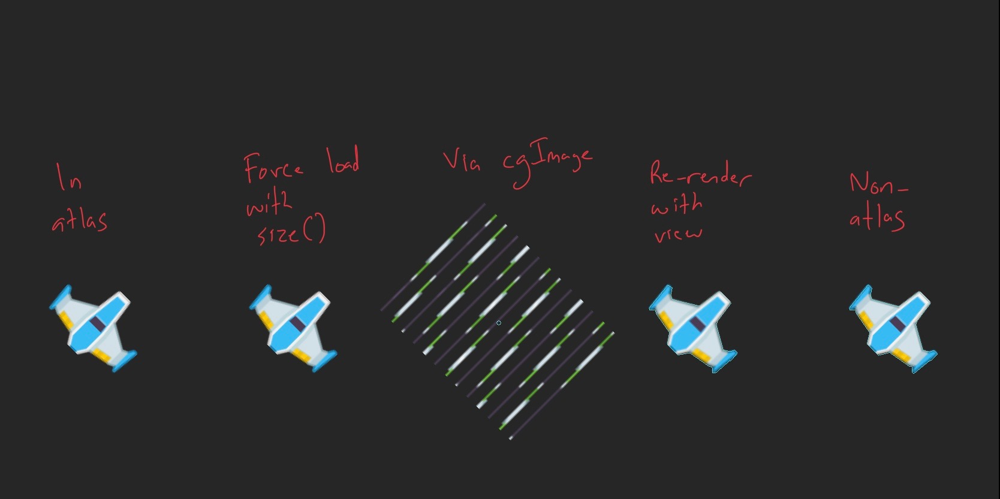

# bugtest
Test of iOS 13 physics body from texture bug avoidance

Built using Xcode version 11.3 (11C29)

Running this on an iPad Pro 11-inch (3rd generation, 2018), iOS version 13.3 produces this console output:

```
2020-02-01 06:23:51.872975-0500 bugtest[14399:9898087] PhysicsBody: Could not create physics body.
simple atlas reference failed
2020-02-01 06:23:51.886387-0500 bugtest[14399:9898087] PhysicsBody: Could not create physics body.
atlas force load failed
2020-02-01 06:23:51.913927-0500 bugtest[14399:9898087] PhysicsBody: Could not create physics body.
reconstruct via cgImage failed
re-render using view worked
not in atlas worked
```

Here's a screen shot with the different attempts:


